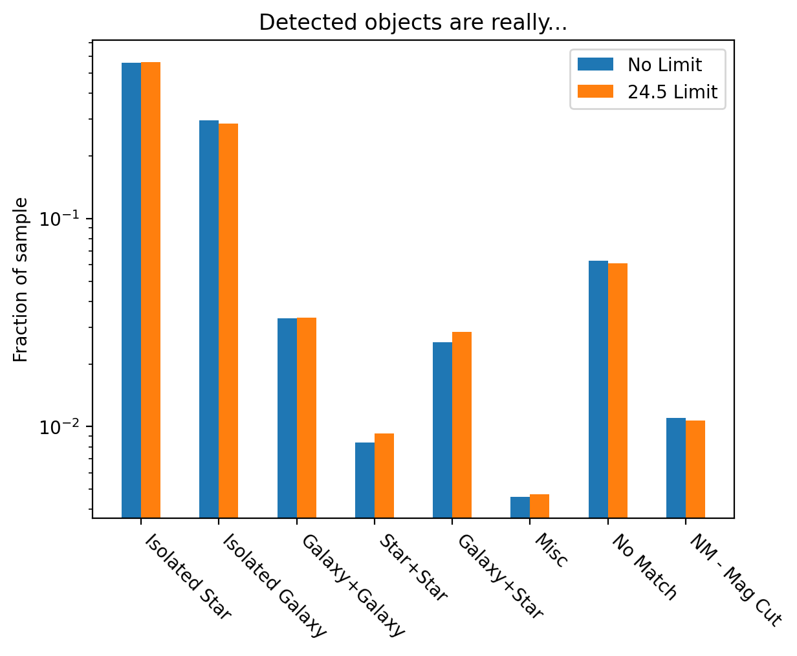
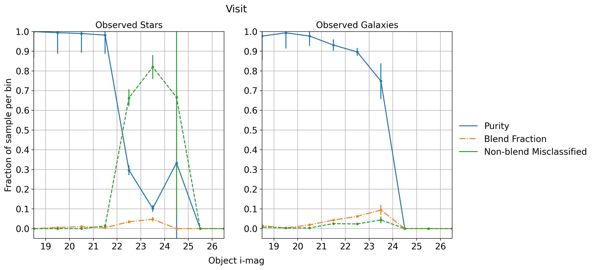
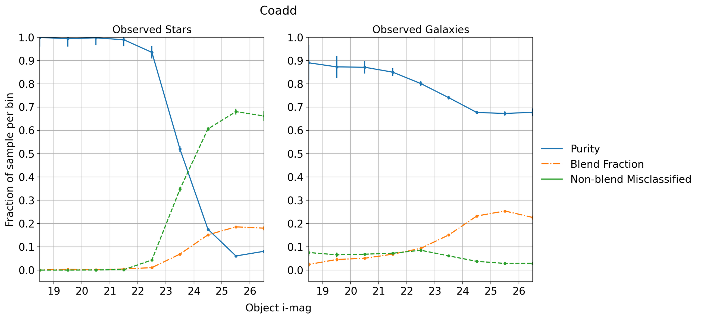
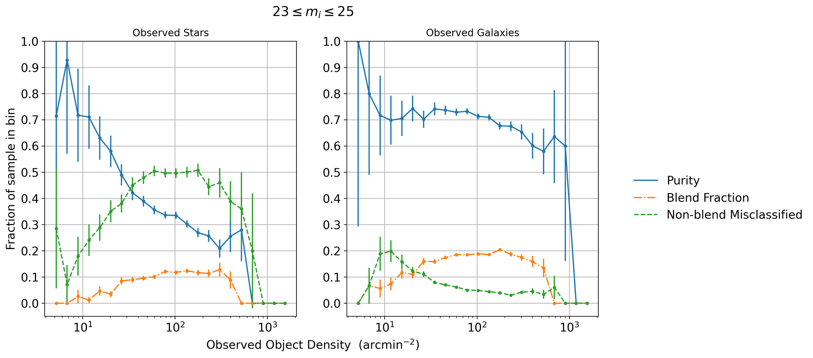

###############################################################################
Point vs Extended Object Classification with Blending in Operations Rehearsal 3
###############################################################################

.. abstract::

   Blending occurs when the flux along a line of sight can be attributed to multiple source objects. This can lead to misclassification of objects which we investigate in the technote. Using observed images generated in Operations Rehearsal 3 matched against the input truth we can identify the true label for each object and compare against the observed label. Objects are classified as isolated or blended and either star (point source) or galaxy (extended source) with subcategories in blends. We focus on the purity, blend fraction, and misclassification rate of each class and operate at both the visit and co-add level. This gives us a baseline that we can use for comparison during commissioning.

Data
===========
.. note::
        Am I allowed to just copy what I had in the other technote here? Should I cite the other one?
..   * Introduce Operations Rehearsal 3 with 3 nights of simulation
   * We are using the "Intermittent Cumulative DRP" catalog

        * Also reference a nightly catalog/collection

   * We need to use the truth catalogs for matching
   * Truth catalogs use galaxies, stars, solar system objects and we are only looking at galaxies and stars
   * We apply the :code:`detect_isPrimary` flag which

        * Works with deblended children, removes sky objects, and is only inner regions
        * Might be a problem to apply cuts before matching but good for understandability
        * Double check!

   * In the observed catalog we only have :code:`extendedness` which is 1 for extended objects. We assume all extended objects are galaxies and use the two interchangibly 

The third Operations Rehearsal (OR3) simulated 3 nights of observation that were then processed by the science pipelines.
The simulations are built on top of a set of DC2 patches which were then processed to mimic realistic observational conditions.
We use both the nightly catalog and the cumulative co-add catalog.
The catalog can be accessed using the :code:`/repo/embargo` repo and found in the :code:`LSSTComCamSim/runs/intermittentcumulativeDRP/20240402_03_04/d_2024_03_29/DM-43865` collection.
We apply the :code:`detect_isPrimary` flag to work with children of blended parent objects, remove sky objects, and restrict to inner regions of CCDs.
In the observed catalog, a proxy for star-galaxy classification can be done via the :code:`extendedness` flag.
In this technote we will use "observed galaxy" and "extended object" interchangibly along with "observed star" with "point source."

To accurately label observed objects, we require the truth catalogs used in the simulation which are found at :code:`/sdf/data/rubin/shared/ops-rehearsals/ops-rehearsal-3/imSim_catalogs`. 
The truth catalogs for this run include galaxies, stars, and solar system objects of which we only consider the galaxies and stars.
The input truth catalog for solar system objects does not include an *i*-magnitude and while they will cause blending, difference imaging is likely to offer much better mitigation of these sources than deblending.

Matching
========
We label objects in the observed catalog into one of 7 categories:

        #. Isolated Star
        #. Isolated Galaxy
        #. Galaxy + Galaxy Blend (G+G)
        #. Star + Star Blend (S+S)
        #. Galaxy + Star Blend (G+S)
        #. Miscellaneous
        #. No Match
        #. No Match after Magnitude Cut 

We use a similar scheme from SITCOMTN-128 where we query around the object and truth tables (using 1'' radius) however instead of focusing on the counts of matches, we focus on the classification of star or galaxy in the truth matches.
It is important to note that we do apply the same cuts on the truth matches as in SITCOMTN-128 where there is a magnitude cut on band X (:math:`m_X < m_b`) and a maximum magnitude difference between a truth object and the brightest truth match in band X (:math:`\Delta_X < m_\Delta.`)
We can also apply a magnitude limit on the observed catalog, an example below with requiring that objects be brighter than some magnitude :math:`m^O_b`.
After applying these cuts we classify observed objects:

   - An object that matches to a single star or galaxy gets mapped to "isolated star" and "isolated galaxy" respectively.
   - An object with 2 truth matches and a single observed match is a type of unrecognized blend specified into three subcategories (G+G, S+S, G+S)
   - An object with 3 or more truth matches to one or more single observed object is classified as Miscellaneous
   - An object with no match or no match after applying the magnitude cut is put in the last two categories.

   Example distribution of objects in a co-add

Star Galaxy Classification
===================================
Once objects are classified we focus on three metrics: purity, blend rate, and non-blend misclassification.

.. math::

   \textrm{Purity} = \frac{\textrm{Number of isolated stars/galaxies}}{\textrm{Total number of observed stars/galaxies}}
.. math::

   \textrm{Blend Rate} = \frac{\textrm{Number of blended objects (G+G, S+S, G+S, Misc)}}{\textrm{Total number of observed stars/galaxies}} 
.. math::

   \textrm{Non-blend Misclassification} = \frac{\textrm{Number of isolated galaxies/stars}}{\textrm{Number of observed stars/galaxies}}

Note that 

.. math::

        \textrm{Purity} + \textrm{Blend Rate} + \textrm{Non-blend Mis.} \lessapprox 1

due to the last two categories, "No Match" and "No Match after Magnitude Cut."

Magnitude
-------------
We bin objects based on their magnitude and present the three metrics for a single visit and a co-add.

   Star-galaxy classification purity, blend fraction, and non-blend misclassification rates against observed i-magnitudes from a single visit

   Star-galaxy classification purity, blend fraction, and non-blend miscassification against observed i-magnitudes on deep coadds. Note that we are looking at a similar region of sky as above and are much better at galaxy classification at the faint end when compared to the single visit.

Density
-----------

Following SITCOMTN-128, we can also investigate how local density would affect classification expecting noisy fields to do worse.

   Star-galaxy classification metrics against observed object density. There is very little dependence on any metric to density.

Seeing
-----------

Let's rebin with seeing parameters
