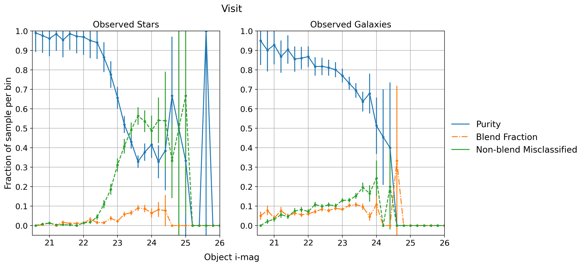
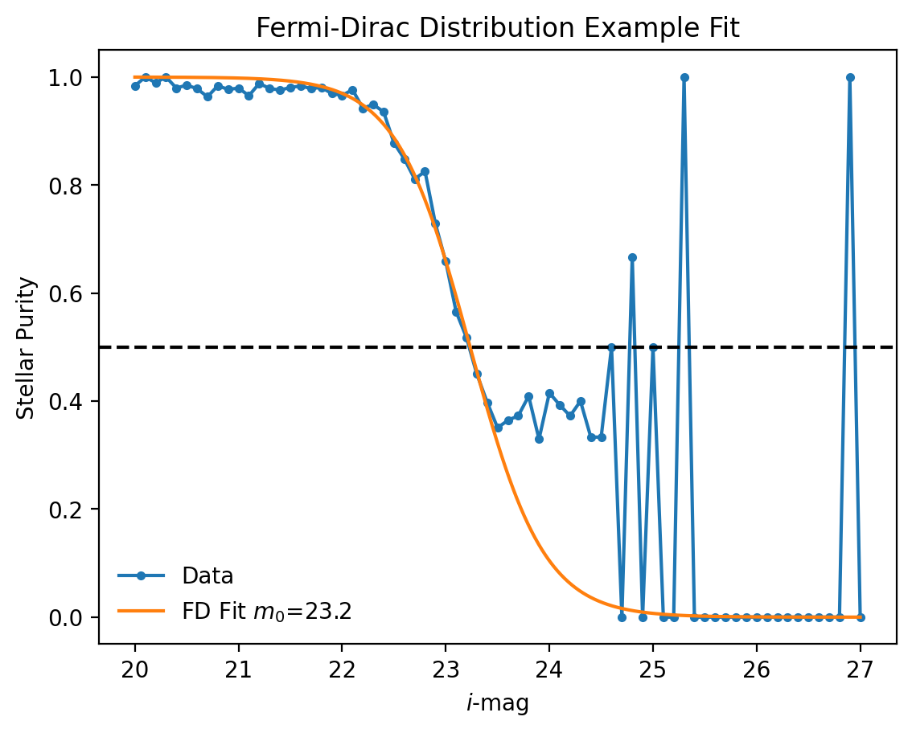
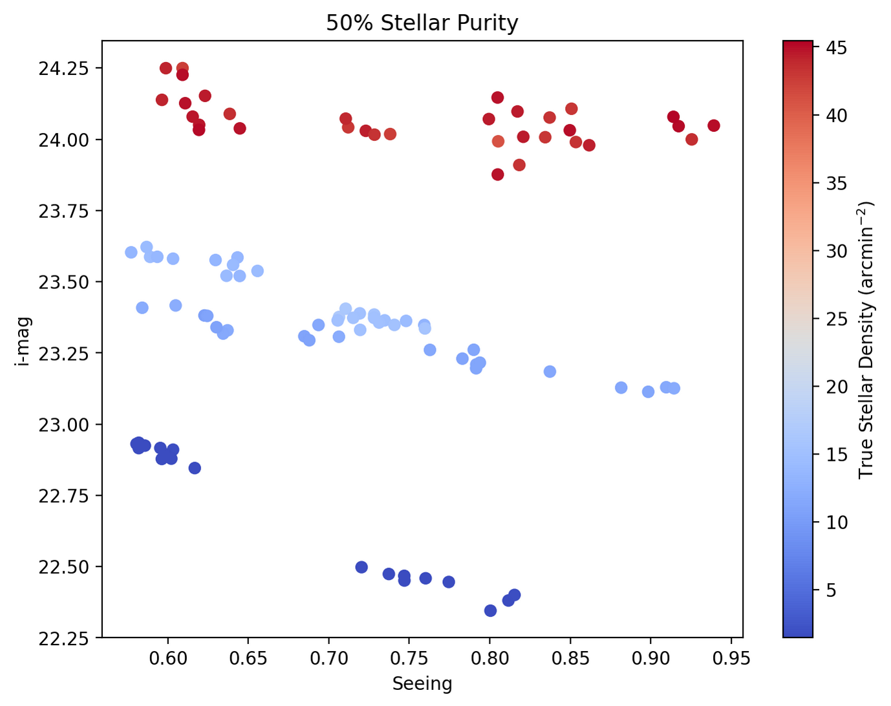
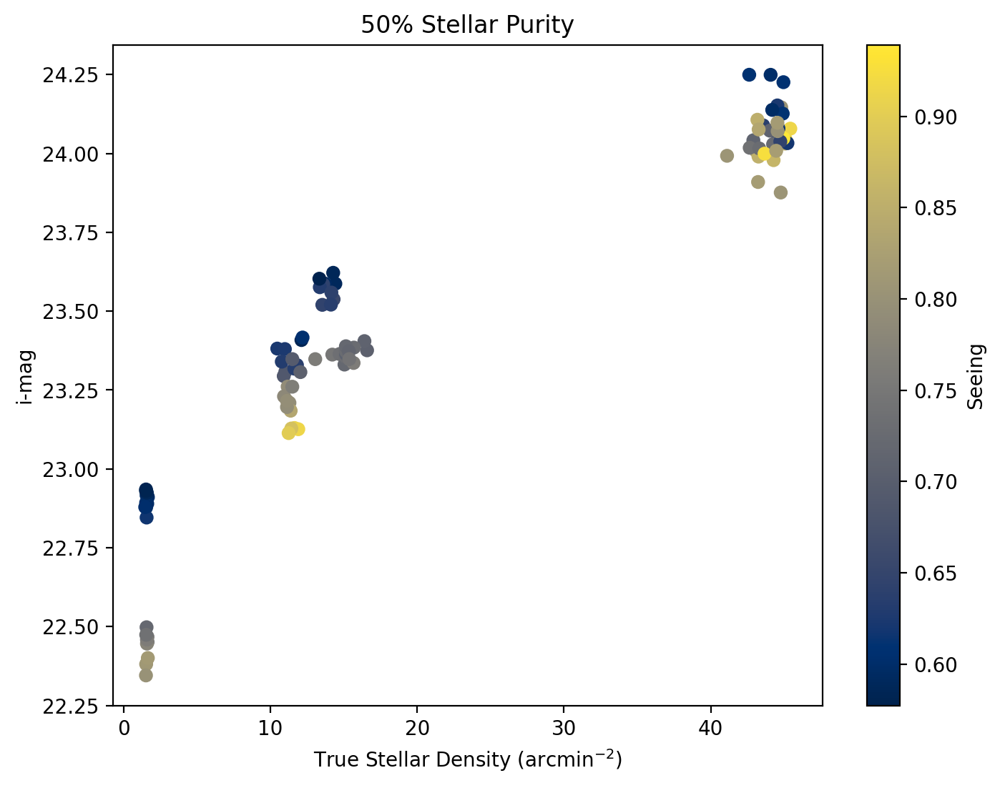

###############################################################################
Point vs Extended Object Classification with Blending in Operations Rehearsal 3
###############################################################################

.. abstract::

   Blending occurs when the flux along a line of sight can be attributed to multiple source objects. This can lead to misclassification of objects which we investigate in the technote. Using observed images generated in Operations Rehearsal 3 matched against the input truth we can identify the true label for each object and compare against the observed label. Objects are classified as isolated or blended and either star (point source) or galaxy (extended source) with subcategories in blends. We focus on the purity, blend fraction, and misclassification rate of each class and operate at both the visit and co-add level. This gives us a baseline that we can use for comparison during commissioning.

Data
===========
.. note::
        Am I allowed to just copy what I had in the other technote here? Should I cite the other one?
..   * Introduce Operations Rehearsal 3 with 3 nights of simulation
   * We are using the "Intermittent Cumulative DRP" catalog

        * Also reference a nightly catalog/collection

   * We need to use the truth catalogs for matching
   * Truth catalogs use galaxies, stars, solar system objects and we are only looking at galaxies and stars
   * We apply the :code:`detect_isPrimary` flag which

        * Works with deblended children, removes sky objects, and is only inner regions
        * Might be a problem to apply cuts before matching but good for understandability

   * In the observed catalog we only have :code:`extendedness` which is 1 for extended objects. We assume all extended objects are galaxies and use the two interchangibly 

The third Operations Rehearsal (OR3) simulated 3 nights of observation that were then processed by the science pipelines.
The simulations are built on top of a set of DC2 patches which were then processed to mimic realistic observational conditions.
We use both the nightly catalog and the cumulative co-add catalog.
The catalog can be accessed using the :code:`/repo/embargo` repo and found in the :code:`LSSTComCamSim/runs/intermittentcumulativeDRP/20240402_03_04/d_2024_03_29/DM-43865` collection.
We apply the :code:`detect_isPrimary` flag to work with children of blended parent objects, remove sky objects, and restrict to inner regions of CCDs.
In the observed catalog, a proxy for star-galaxy classification can be done via the :code:`extendedness` flag.
In this technote we will use "observed galaxy" and "extended object" interchangibly along with "observed star" with "point source."

To accurately label observed objects, we require the truth catalogs used in the simulation which are found at :code:`/sdf/data/rubin/shared/ops-rehearsals/ops-rehearsal-3/imSim_catalogs`. 
The truth catalogs for this run include galaxies, stars, and solar system objects of which we only consider the galaxies and stars.
The input truth catalog for solar system objects does not include an *i*-magnitude and while they will cause blending, difference imaging is likely to offer much better mitigation of these sources than deblending.

Matching
========
We label objects in the observed catalog into one of 7 categories:

        #. Isolated Star
        #. Isolated Galaxy
        #. Galaxy + Galaxy Blend (G+G)
        #. Star + Star Blend (S+S)
        #. Galaxy + Star Blend (G+S)
        #. Miscellaneous
        #. No Match
        #. No Match after Magnitude Cut 

We use a similar scheme from SITCOMTN-128 where we query around the object and truth tables (using 1'' radius) however instead of focusing on the counts of matches, we focus on the classification of star or galaxy in the truth matches.
It is important to note that we do apply the same cuts on the truth matches as in SITCOMTN-128 where there is a magnitude cut on band X (:math:`m_X < m_b`) and a maximum magnitude difference between a truth object and the brightest truth match in band X (:math:`\Delta_X < m_\Delta.`)
We can also apply a magnitude limit on the observed catalog, an example below with requiring that objects be brighter than some magnitude :math:`m^O_b`.
After applying these cuts we classify observed objects:

   - An object that matches to a single star or galaxy gets mapped to "isolated star" and "isolated galaxy" respectively.
   - An object with 2 truth matches and a single observed match is a type of unrecognized blend specified into three subcategories (G+G, S+S, G+S)
   - An object with 3 or more truth matches to one or more single observed object is classified as Miscellaneous
   - An object with no match or no match after applying the magnitude cut is put in the last two categories.

.. figure:: ./_static/object_class_example.png

   Example distribution of objects in a co-add. 

Star Galaxy Classification
===================================
Once objects are classified we focus on three metrics: purity, blend rate, and non-blend misclassification.

.. math::

   \textrm{Purity} = \frac{\textrm{Number of isolated stars/galaxies per bin }}{\textrm{Total number of observed stars/galaxies per bin }}
.. math::

   \textrm{Blend Rate} = \frac{\textrm{Number of blended objects (G+G, S+S, G+S, Misc) per bin }}{\textrm{Total number of observed stars/galaxies per bin }} 
.. math::

   \textrm{Non-blend Misclassification} = \frac{\textrm{Number of isolated galaxies/stars per bin }}{\textrm{Number of observed stars/galaxies per bin }}

Note that 

.. math::

        \textrm{Purity} + \textrm{Blend Rate} + \textrm{Non-blend Mis.} \lessapprox 1

due to the last two categories, "No Match" and "No Match after Magnitude Cut."

Magnitude
-------------
We bin objects based on their :math:`i`-magnitude and present the three metrics for visits versus and a co-add.

.. _singlepurity:
.. figure:: ./_static/visit_imag.png

   Star-galaxy classification purity, blend fraction, and non-blend misclassification rates against observed i-magnitudes from a single visit.

.. _otherpurity:

   Another example of star-galaxy classification on a different visit. This is using smaller bins than the example above to highlight the plateau of stellar purity at 23 :math:`i`-mag.

.. figure:: ./_static/coadd_mag.png

   Star-galaxy classification purity, blend fraction, and non-blend miscassification against observed i-magnitudes on deep coadds. We are much better at galaxy classification at the faint end when compared to the single visit.

In single visits we see a drop in galaxy classification at around :math:`i \sim 24` and a similar drop at around :math:`i \sim 23` for stars.
When coadding, the drop in stars is shifted to slighly deeper magnitudes while enabling detection of far fainter galaxies.
Coadding helps tremendously with galaxy identification.

Seeing and Stellar Density
------------------------------
We expect our star-galaxy classification scheme to vary with stellar density.
However, the seeing of a visit will also affect the number of objects detected as extendeded (galaxies).

As seen in :numref:`singlepurity` and :numref:`otherpurity` the stellar classification starts very close to one and then drops off at some magnitude whereas the galaxy classification has less uniform behavior.
We can use the drop in stellar purity, specifically the magnitude at which we have 50% stellar purity, to characterize the pipeline classification 

As seen in those examples, there are times the stellar purity does not drop down to 0 in our magnitude range or has a very noisy tail. 
To account for this we fit a Fermi-Dirac (FD) distribution to the stellar purity and then have an analytic expression for the 50% purity.
The distribution takes the form 

.. math::

    P(m) = \frac{1}{e^{\beta(m - m_0)} + 1} 

where the fitted parameter :math:`m_0` is the 50% purity magnitude ( :math:`\beta` is a nuisance parameter). 

An example is shown below in :numref:`exampleFD`. 

.. _exampleFD:

    An example fit to stellar purity.

For each visit we then have the true stellar/galaxy/object density, observed stellar/galaxy/object density, and seeing.
For :math:`i`-band visits we label objects, calculate the classification metrics (purity, blend fraction, and non-blend misclassification), fit a FD distribution, and extract a 50% purity.

.. 
    Below (:numref:`sp-seeing` and :numref:`sp-stellardensity`) we show the results using 100 visits. 

In :numref:`sp-seeing` we see that with lower seeing we are able to see deeper (fainter 50%) but it is quite dependent on stellar density where, paradoxically, the higher the density, the less the seeing matters.
In the next plot, :numref:`sp-stellardensity`,  we see that for a density there is anywhere from a .25 to 1 magnitude improvement with better seeing.

.. _sp-seeing:

    :math:`i`-magnitude of 50% stellar purity versus seeing for a visit. Color coded based on the true stellar density with red indicating high true stellar density and blue for low true stellar density. We see that for any seeing, there is better depth with higher stellar density.

.. _sp-stellardensity:

    :math:`i`-magnitude of 50% stellar purity versus true stellar density for a visit. Color coded based on the seeing with yellow indicating high seeing and blue for low seeing. At a fixed density, we see the expected behavior of better depth with lower seeing.

Conclusion
===========

We have extended our algorithm to label unrecognized blends outlined in SITCOMTN-128 in order to study star-galaxy classification.
Using metrics such as purity, non-blend misclassification, and blend rate we can quantify the pipeline's classification and how that varies with factors such as object magnitude, observed density, seeing, and stellar density.
To compress this information and study the interplay between several factors, we extract the magnitude at which only 50% of observed stars are truly stars. 
We find that we are able to go to fainter magnitudes with better seeing, as expected, but can get fainter magnitudes when we have a higher stellar density which is somewhat counter-intuitive.
